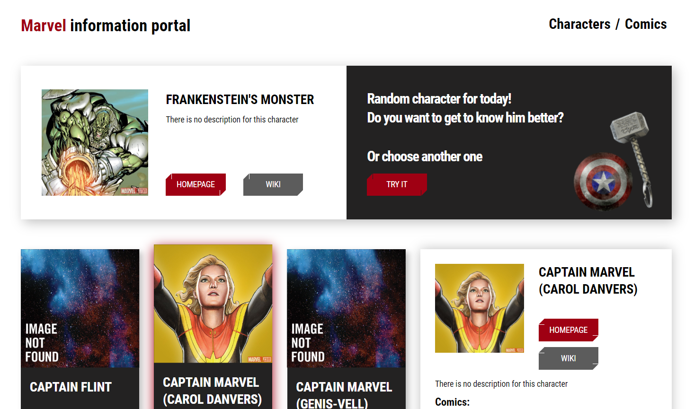
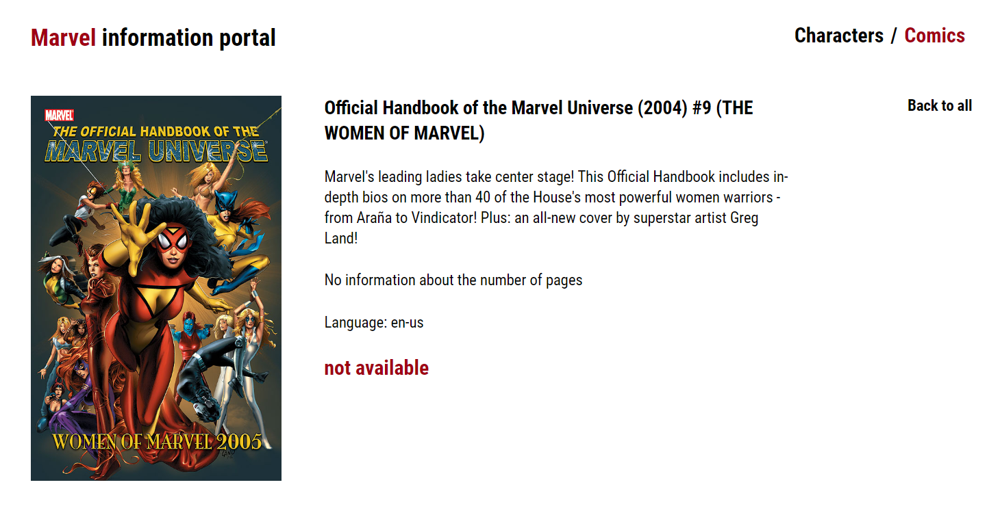

<!-- PROJECT LOGO -->
<div align="center">
  <h1 align="center">Marvel Portal</h1>
  <p align="center">
    Приложение о персонажах и комиксах Marvel
    <br />
    <br />
    <a href="https://regina5425.github.io/marvel_page/">Посмотреть демо</a>
  </p>
</div>


<!-- ABOUT THE PROJECT -->
## О проекте

<div align="center">
  <span>
    
   </span>
   <span>
    
   </span>
</div>

Реализовано:
* показ рандомного персонажа при загрузке страницы, либо по нажатию на кнопку;
* выбор персонажа и показ информации о нем;
* загрузка дополнительных персонажей по нажатию кнопки загрузить;
* переход на страницу комиксов;
* выбор комикса и отображение информации


### Стек

React, React Hooks, JavaScript, REST API, SASS, HTML


<!-- GETTING STARTED -->
### Установка

1. Склонировать репозиторий
   ```sh
   git clone https://github.com/Regina5425/marvel_page.git
   ```
2. Установить NPM пакеты
   ```sh
   npm install
   ```
3. Запустить приложение на вашем локальном сервере
   ```js
   npm start
   ```

<!-- CONTACT -->
## Контакты

Регина А. - reina5425@gmail.com

Ссылка на проект: [https://github.com/Regina5425/marvel_page](https://github.com/Regina5425/marvel_page)
